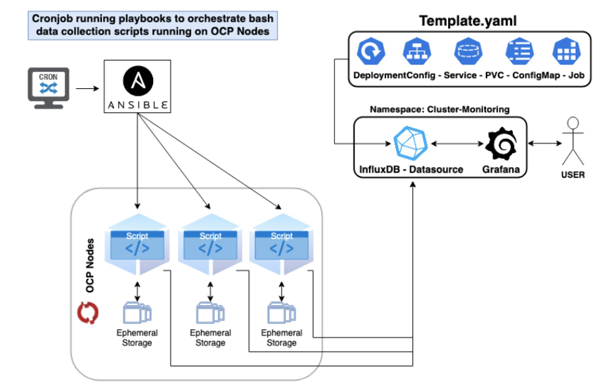

# Custom-Datasource

18/05/2020 Project Status:
All the components works just fine, there are few point of improoments to follow up:
 - Extract "hardcoded" values from the template parametners (namespace ...) and merge it in a file parameters (i.e. --param-file=clusterA.env)
 - Secure password under secret/base64

The project create a new datasource in Grafana to collect Ephimeral storage & Images size of the cluster via bash script installed on the nodes. The bash script inject only these two type of values but can be tweek to inject any other kind of value for any other projects to create custom dashboards.

## Components

- **data-scraping.sh**

It collects the data from the cluster nodes and sends them to the InfluxDB API (Grafana datasource)

- **data-scraping-playbook.yaml**

It orchestrates the scripts over the cluster from the Ansible server

- **Influxdb-template.yaml**

It deploys and configures the alternative datasource to be used in Grafana

--------------

## Data Scraping Flowchart

## Setup (check vars)

1. Deploy the Influxdb-template.yaml in your favourite namespace.

2. Save on every node you wish to collect data the data-scraping bash script.

3. Save the data-scraping-playbook.yaml on the Ansible controller and create a cron to execute it evey X min (depending on needs).
